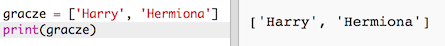

## Gracze

Zacznijmy od stworzenia listy graczy do wyboru.

+ Otwórz pusty szablon Pythona Trinket: <a href="http://jumpto.cc/python-new" target="_blank">jumpto.cc/python-new</a>.

+ Możesz użyć zmiennej do przechowywania **listy** graczy. Lista powinna być w nawiasach kwadratowych `[]`, z przecinkiem między każdą pozycją na liście.
    
    Zacznij od dodania listy graczy do twojego programu.
    
    

+ Dodaj poniższy kod, aby wypisać wartość zmiennej `gracze`:
    
    

+ Możesz dostać się do pozycji na liście, dodając jej pozycję w nawiasach kwadratowych po nazwie zmiennej.
    
    Pierwsza pozycja na liście to **pozycja 0**. To inaczej niż w Scratchu, gdzie zaczynaliśmy od pozycji 1.
    
    