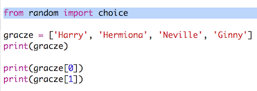
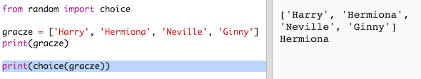
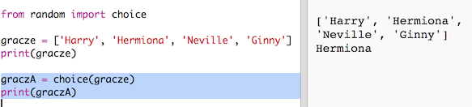
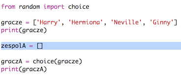
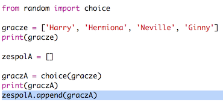
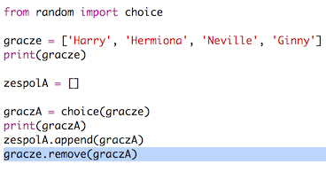
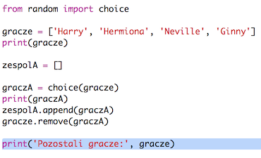

## Losowi gracze

Wybierzmy losowych graczy!

+ Aby wybrać losowego gracza z listy `gracze`, najpierw należy zaimportować `choice` z modułu `random`.
    
    

+ Aby wybrać losowego gracza, możesz użyć `choice`. (Możesz również usunąć kod, który wypisuje poszczególnych graczy.)
    
    

+ Przetestuj swój kod z funkcją `choice` kilka razy, a za każdym razem powinieneś zobaczyć innego gracza.

+ Możesz też utworzyć nową zmienną o nazwie `graczA` i użyć jej do przechowywania wylosowanego gracza.
    
    

+ Będziesz potrzebować nowej listy do przechowywania wszystkich graczy w zespole A. Na początku ta lista powinna być pusta.
    
    

+ Możesz teraz dodać wylosowanego gracza do listy `zespolA`. Aby to zrobić, możesz użyć `zespolA.append` (**append** oznacza dodanie na koniec listy).
    
    

+ Po wybraniu gracza możesz usunąć go z listy `gracze`.
    
    

+ Przetestuj ten kod, dodając polecenie `print`, aby pokazać, którzy `gracze` nie zostali jeszcze wylosowani.
    
    
    
    W powyższym przykładzie Hermiona została wybrana do `zespolA` i została usunięta z listy `gracze`.