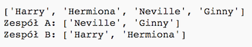

## Wybieranie wielu graczy

Następnie musisz upewnić się, że każdy gracz został wybrany do zespołu.

+ Podświetl swój kod, aby wybrać graczy dla drużyny A i zespołu B i naciśnij klawisz tabulacji, aby wprowadzić kod.
    
    

+ Dodaj **, podczas gdy** zapętla, aby dalej wybierać graczy, dopóki długość `graczy` lista wynosi 0.
    
    

+ Uruchom swój kod, aby go przetestować. Powinieneś zobaczyć graczy wybranych do drużyny A i drużyny B, dopóki nie pozostanie więcej graczy.
    
    

+ Dodaj kod, aby wydrukować swój zespół `A` lista **po** swoim `podczas gdy pętla` (upewniając się, że nie jest wcięta).
    
    Oznacza to, że `drużynaA` zostanie wydrukowana tylko raz, po wybraniu wszystkich graczy.
    
    

+ Możesz zrobić to samo dla `zespołu B`, możesz też usunąć inne polecenia drukowania, ponieważ były tam tylko po to, aby przetestować twój kod.
    
    Oto, jak powinien wyglądać twój kod:
    
    

+ Przetestuj swój kod ponownie i powinieneś zobaczyć listę graczy, a także końcowe drużyny.
    
    