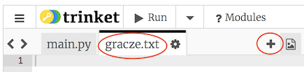

## Akta

Możesz użyć pliku do przechowywania listy graczy.

+ Kliknij ikonę + i utwórz nowy plik o nazwie `players.txt`.
    
    

+ Dodaj swoich graczy do nowego pliku. Upewnij się, że po twoim ostatnim graczu nie ma pustej linii.
    
    

+ Zmień listę `graczy` tak, aby była pusta.
    
    

+ Otwórz plik `players.txt` ( `'r'` oznacza tylko do odczytu).
    
    

+ Przeczytaj listę z pliku i dodaj do listy `graczy`. (Kod `podziałów` oznacza, że ​​każda linia w pliku jest nową pozycją na liście `graczy`).
    
    

+ Jeśli przetestujesz swój kod, powinien on działać dokładnie tak samo jak poprzednio. Teraz jednak znacznie łatwiej jest dodać graczy do twojego `players.txt` pliku.