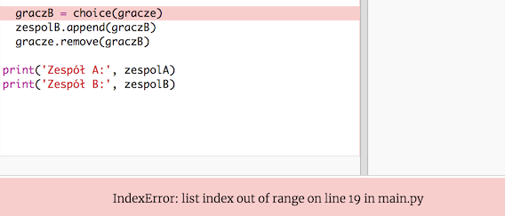

## Nieparzyści gracze

Udoskonalmy twój program, aby działał z nieparzystą liczbą graczy.

+ Dodaj kolejne imię do listy `gracze.txt` tak, aby mieć nieparzystą liczbę graczy.
    
    

+ Jeśli przetestujesz kod, zobaczysz komunikat o błędzie.
    
    

+ Błąd polega na tym, że twój program wybiera losowych graczy do zespołu A, a następnie do zespołu B. Jeśli jednak liczba graczy jest nieparzysta, to po wybraniu gracza do zespołu A nie ma już żadnych graczy do wyboru do zespołu B.
    
    Aby naprawić ten błąd, możesz powiedzieć programowi, aby przerwał (ang. `break`) wykonywanie kodu w pętli `while`, jeśli twoja lista `gracze` jest pusta.
    
    

+ Kiedy ponownie przetestujesz swój kod, powinieneś zobaczyć, że działa on teraz poprawnie z nieparzystą liczbą graczy.
    
    