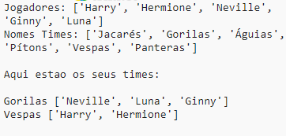

## Introdução:

Neste projeto, você aprenderá a criar duas equipes aleatórias de uma lista de jogadores.

  <iframe src="https://trinket.io/embed/python/a699c44ce6?outputOnly=true&start=result" width="600" height="500" frameborder="0" marginwidth="0" marginheight="0" allowfullscreen>
  </iframe>
  

### Informação adicional para líderes de clubes

Se você precisar imprimir este projeto, use a [versão para impressão](https://projects.raspberrypi.org/en/projects/team-chooser/print).

## \--- colapso \---

## título: notas do líder do clube

## Introdução:

Neste projeto, as crianças aprenderão como fazer um programa para dividir uma lista de jogadores em duas equipes aleatórias. Este projeto ensina listas e usa arquivos.

## Recursos online

**Este projeto usa o Python 3.** Recomendamos usar [trinket](https://trinket.io/) para escrever Python online. Este projeto contém os seguintes Trinkets:

* [Novo Trinket Python (em branco) - jumpto.cc/python-new](http://jumpto.cc/python-new)

Há também uma bugiganga contendo o projeto concluído:

* ['Team Chooser' terminado - trinket.io/python/a699c44ce6](https://trinket.io/python/a699c44ce6)

## Recursos offline

Este projeto pode ser [concluído off-line](https://www.codeclubprojects.org/en-GB/resources/python-working-offline/) , se preferir. Você pode acessar os recursos do projeto clicando no link 'Project Materials' para este projeto. Este link contém uma seção "Recursos do Projeto", que inclui recursos que as crianças precisarão para concluir esse projeto off-line. Certifique-se de que cada criança tenha acesso a uma cópia desses recursos. Esta seção inclui os seguintes arquivos:

* team / team.py

Você também pode encontrar uma versão completa deste projeto na seção 'Recursos para Voluntários', que contém:

* team-finished / team.py

(Todos os recursos acima também podem ser baixados como arquivos `.zip` do projeto e voluntários.)

## objetivos de aprendizado

* Listas;
* Carregando dados da lista de um arquivo.

Este projeto abrange elementos das seguintes vertentes do [Raspberry Pi Digital Making Curriculum](http://rpf.io/curriculum):

* [Use construções básicas de programação para criar programas simples.](https://www.raspberrypi.org/curriculum/programming/creator)

## Desafios

* "Adicionando mais jogadores" - adicionando elementos a uma lista de `jogadores`;
* "Escolhendo para o time B" - criando uma nova lista `teamB` para adicionar jogadores aleatórios;
* "Random team names" - criando e usando uma nova lista `teamNames` para atribuir nomes aleatórios às equipes;
* "Armazenando nomes de equipe" - armazenando nomes de equipe em um arquivo e carregando-os em uma variável `teamNames`;
* "Mais equipas" - dividindo os jogadores em 3 equipas em vez de 2.

\--- / colapso \---

## \--- colapso \---

## Título: Materiais do projeto

## Recursos do projeto

* [arquivo .zip contendo todos os recursos do projeto](resources/team-chooser-project-resources.zip)
* [Trinket de Python em branco on-line](http://jumpto.cc/python-new)
* [Arquivo Python offline em branco](resources/new-new.py)

## Recursos do líder do clube

* [arquivo .zip contendo todos os recursos do projeto concluídos](resources/team-chooser-volunteer-resources.zip)
* [Projeto Trinket concluído online](https://trinket.io/python/a699c44ce6)
* [team-chooser-finished / team-chooser.py](resources/team-chooser-finished-team-chooser.py)

\--- / colapso \---