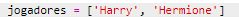
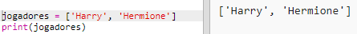
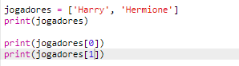

## Jogadoras

Vamos começar criando uma lista de jogadores para escolher.

+ Abra o modelo Trinket em branco do Python: <a href="http://jumpto.cc/python-new" target="_blank">jumpto.cc/python-new</a>.

+ Você pode usar uma variável para armazenar uma **lista** de jogadores. A lista deve estar entre colchetes `[]`, com uma vírgula entre cada item da lista.
    
    Comece adicionando uma lista de jogadores ao seu programa.
    
    

+ Adicione este código para imprimir sua variável `jogadores`:
    
    

+ Você pode chegar a um item na lista adicionando sua posição entre colchetes após o nome da variável.
    
    O primeiro item da lista está na **posição 0**. Isso é diferente do Scratch, que começa na posição 1.
    
    