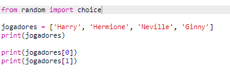
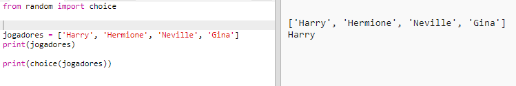
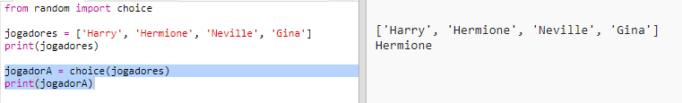
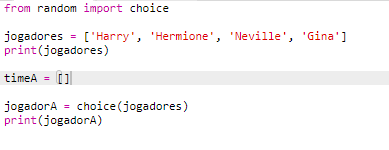
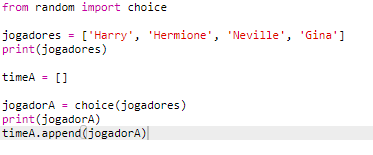
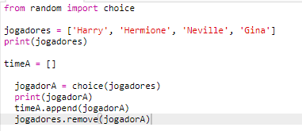
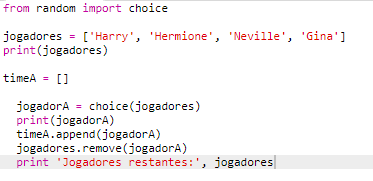

## Jogadores aleatórios

Vamos escolher jogadores aleatórios!

+ Para conseguir obter um usuário aleatório da sua lista de `jogadores`, primeiro você precisa importar o `choice` que faz parte do módulo `random`.
    
    

+ Para obter um player aleatório, você pode usar a `choice`. (Você também pode excluir o código para imprimir jogadores individuais.)
    
    

+ Teste seu código `choice` algumas vezes e você verá um jogador diferente sendo escolhido a cada vez.

+ Você também pode criar uma nova variável chamada `jogadorA` e usá-la para armazenar seu player aleatório.
    
    

+ Você precisará de uma nova lista para armazenar todos os jogadores da equipe A. Para começar, essa lista deve estar vazia.
    
    

+ Agora você pode adicionar seu player escolhido aleatoriamente ao `teamA`. Para fazer isso, você pode usar `teamA.append` (**acrescentar** significa adicionar ao final).
    
    

+ Agora que seu jogador foi escolhido, você pode removê-lo de sua lista de `jogadores`.
    
    

+ Teste este código adicionando um `print` comando, para mostrar os `jogadores` restantes para escolher.
    
    
    
    No exemplo acima, Hermione foi escolhida para `teamA`e, portanto, foi removida da lista de `jogadores`.