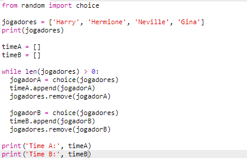

## Escolhendo muitos jogadores

Em seguida, você precisará ter certeza de que todos os jogadores foram escolhidos para um time.

+ Realce seu código para escolher jogadores para a equipe A e B e pressione a tecla tab para indentar o código.
    
    

+ Adicione um **enquanto** loop para continuar escolhendo os jogadores até o comprimento da lista `jogadores` é 0.
    
    

+ Execute seu código para testá-lo. Você deve ver os jogadores sendo escolhidos para o time A e o time B até que não haja mais jogadores restantes.
    
    

+ Adicione código para imprimir sua `teamA` lista **após** seu `enquanto` loop (certificando-se de que não é recuado).
    
    Isso significa que `teamA` será impresso apenas uma vez, após todos os jogadores terem sido escolhidos.
    
    

+ Você pode fazer o mesmo para `teamB`, e você também pode excluir os outros comandos de impressão, pois eles estavam lá apenas para testar seu código.
    
    Veja como seu código deve ficar:
    
    

+ Teste seu código novamente e você deve apenas ver sua lista de jogadores, assim como suas equipes finais.
    
    