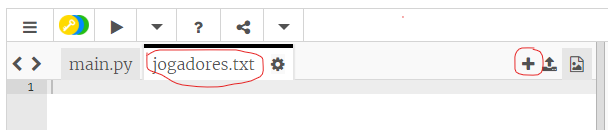
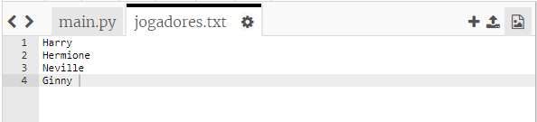
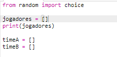
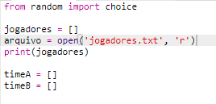
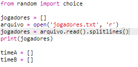

## arquivos

Você pode usar um arquivo para armazenar sua lista de jogadores.

+ Clique no ícone + e crie um novo arquivo chamado `players.txt`.
    
    

+ Adicione seus jogadores ao seu novo arquivo. Certifique-se de que não há linha em branco depois do seu último jogador.
    
    

+ Altere sua lista `jogadores` para que ela fique vazia.
    
    

+ Abra o seu arquivo `players.txt` (o `'r'` significa somente leitura).
    
    

+ Leia a lista do arquivo e adicione à sua lista de `jogadores`. (O `splitlines` code significa que cada linha no arquivo é um novo item na lista `jogadores`).
    
    

+ Se você testar seu código, ele deve funcionar exatamente como antes. No entanto, agora é muito mais fácil adicionar jogadores ao seu arquivo `players.txt`.