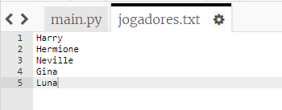
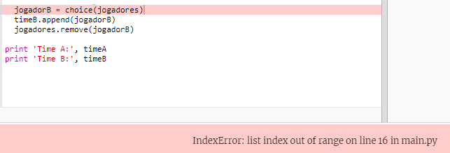
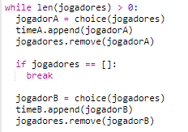
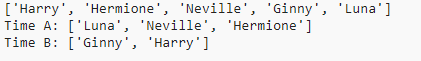

## Jogadores ímpares

Vamos melhorar seu programa para trabalhar com um número ímpar de jogadores.

+ Adicione outro nome à sua lista `jogadores.txt` , para que você tenha um número ímpar de jogadores.
    
    

+ Se você testar seu código, verá uma mensagem de erro.
    
    

+ O erro ocorre porque seu programa continua escolhendo jogadores aleatórios para a equipe A e depois para a equipe B. No entanto, se houver um número ímpar de jogadores, depois de escolher um jogador para a equipe A, não há mais jogadores para escolher para a equipe B.
    
    Para corrigir esse bug, você pode dizer ao seu programa para `quebrar` de seu `enquanto` loop se sua lista `jogadores` estiver vazia.
    
    

+ Se você testar seu código novamente, verá que agora ele funciona com um número ímpar de jogadores.
    
    