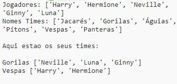

--- challenge ---

## Desafio: nomes aleatórios de equipes

Você pode dar a ambas as equipes um nome de equipe aleatório?

Você pode criar uma lista chamada `nomesTimes` contendo os nomes para escolher.

Você pode então escolher (e exibir) um nome aleatório para cada equipe.

--- /challenge ---