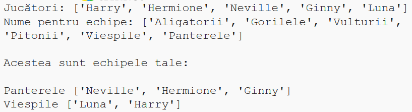

## Introducere:

În acest proiect, vei învăța cum să creezi 2 echipe aleatorii dintr-o listă de jucători.

  <iframe src="https://trinket.io/embed/python/a699c44ce6?outputOnly=true&start=result" width="600" height="500" frameborder="0" marginwidth="0" marginheight="0" allowfullscreen>
  </iframe>
  

### Informații suplimentare pentru conducătorii de club

Dacă vrei să printezi acest proiect, folosește [Versiunea printabilă](https://projects.raspberrypi.org/en/projects/team-chooser/print).

## \--- collapse \---

## title: Note pentru conducătorul clubului

## Introducere:

În acest proiect, copiii vor învăța cum să facă un program care împarte o listă de jucători în două echipe aleatorii. Acest proiect predă listele și utilizarea fișierelor.

## Resurse online

**Acest proiect utilizează Python 3.** Îți recomandăm să utilizezi [trinket](https://trinket.io/) pentru a scrie cod în Python online. Acest proiect conține următoarele Trinket-uri:

* [Trinket Python nou (necompletat) -- jumpto.cc/python-new](http://jumpto.cc/python-new)

Există, de asemenea, un trinket care conține proiectul final:

* [„Creator de echipe” completat -- trinket.io/python/a699c44ce6](https://trinket.io/python/a699c44ce6)

## Resurse offline

Acest proiect poate fi [completat offline](https://www.codeclubprojects.org/en-GB/resources/python-working-offline/) dacă dorești. Poți accesa resursele proiectului dând click pe link-ul „Materialele proiectului” pentru acest proiect. Acest link conține o secțiune „Resursele proiectului” care include resurse de care copiii vor avea nevoie pentru a completa acest proiect offline. Asigură-te că fiecare copil are acces la o copie a acestor resurse. Această secțiune include următoarele fișiere:

* team/team.py

De asemenea, poți găsi proiectul finalizat în secțiunea „Resurse pentru voluntari”, care conține:

* team-finished/team.py

(Toate resursele de mai sus pot fi descărcate și ca fișiere `.zip`.)

## Obiective de învățare

* Liste;
* Încărcarea datelor pentru o listă dintr-un fișier.

Acest proiect acoperă elemente din următoarele domenii ale [Raspberry Pi Digital Making Curriculum](http://rpf.io/curriculum):

* [Folosirea unor structuri de bază în programare pentru a crea programe simple.](https://www.raspberrypi.org/curriculum/programming/creator)

## Provocări

* „Adăugarea mai multor jucători” - adăugarea elementelor la o listă `jucatori`;
* „Alegerea jucătorilor pentru echipa B” - crearea unei noi liste `echipaB` la care să se adauge jucători la întâmplare;
* „Nume de echipe la întâmplare” - crearea și utilizarea unei noi liste `numeEchipe` pentru a atribui nume aleatorii echipelor;
* „Salvarea numelor echipelor” - salvarea numelor echipelor într-un fișier și încărcarea lor într-o variabilă `numeEchipe`;
* „Mai multe echipe” - împărțirea jucătorilor în 3 echipe în loc de două.

\--- /collapse \---

## \--- collapse \---

## title: Materialele proiectului

## Resursele proiectului

* Poți [găsi resursele proiectului aici](http://rpf.io/p/en/team-chooser-go){:target="_blank"}.
* [Trinket Python online gol](http://jumpto.cc/python-new)
* [Fișier Python offline gol](resources/new-new.py)

## Resurse pentru conducătorul clubului

* Poți [găsi soluțiile proiectului aici](http://rpf.io/p/en/team-chooser-get){:target="_blank"}.
* [Proiect Trinket online, completat](https://trinket.io/python/a699c44ce6)
* [team-chooser-finished/team-chooser.py](resources/team-chooser-finished-team-chooser.py)

\--- /collapse \---