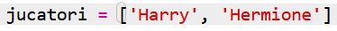
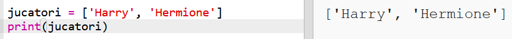
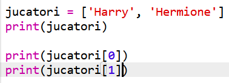

## Jucători

Să începem prin crearea unei liste de jucători din care se va alege.

+ Deschide un șablon Trinket nou pentru Python: <a href="http://jumpto.cc/python-new" target="_blank">jumpto.cc/python-new</a>.

+ Poți folosi o variabilă pentru a reține o **listă** de jucători. Lista trebuie să fie între paranteze drepte `[ ]`, cu o virgulă între fiecare element din listă.
    
    Începe prin a adăuga o listă de jucători la programul tău.
    
    

+ Adaugă acest cod pentru a afișa variabila ta `jucatori`:
    
    

+ Poți ajunge la un element din listă prin adăugarea poziției acestuia între paranteze drepte după numele variabilei.
    
    Primul element din listă se află la **poziția 0**. Acest lucru este diferit de Scratch, unde listele încep de la poziția 1.
    
    