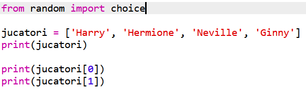
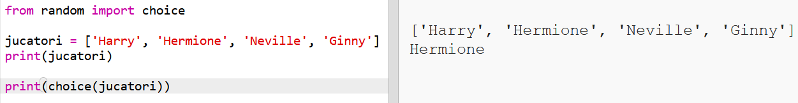
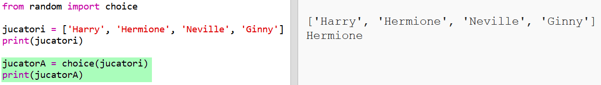
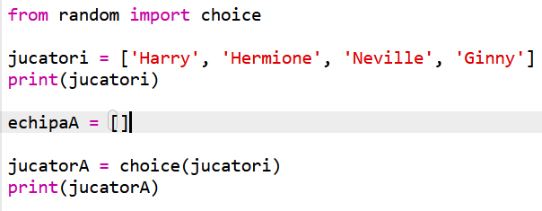
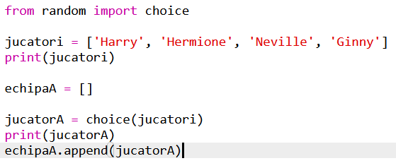
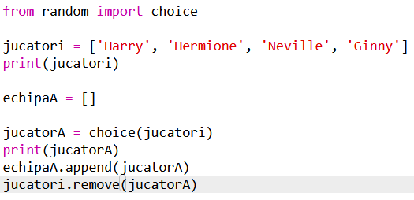
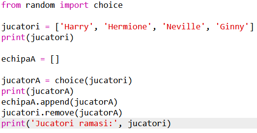

## Jucători la întâmplare

Să alegem jucători la întâmplare!

+ Pentru a putea obține un jucător aleatoriu din lista ta `jucatori`, întâi va trebui să imporți `choice` din modulul `random`.
    
    

+ Pentru a obține un jucător aleatoriu, poți folosi `choice`. (Poți de asemenea să ștergi codul pentru a afișa jucători individuali.)
    
    

+ Testează codul tău ce folosește `choice` de câteva ori și ar trebui să vezi un jucător diferit ales de fiecare dată.

+ Poți de asemenea să creezi o nouă variabilă numită `jucatorA`, și să o folosești pentru a reține jucătorul tău aleatoriu.
    
    

+ Vei avea nevoie de o nouă listă pentru a reține toți jucătorii din echipa A. Pentru început, această listă trebuie să fie goală.
    
    

+ Acum poți adăuga jucătorul tău ales aleatoriu la `echipaA`. Pentru a face asta, poți folosi `echipaA.append` (**append** înseamnă adăugare la sfârșit).
    
    

+ Acum că jucătorul tău a fost ales, îl poți scoate din lista ta de `jucatori`.
    
    

+ Testează acest cod prin adăugarea comenzii `print`, pentru a afișa `jucatorii` care au rămas de ales.
    
    
    
    În exemplul de sus, Hermione a fost aleasă pentru `echipaA` și astfel a fost eliminată din lista de `jucatori`.