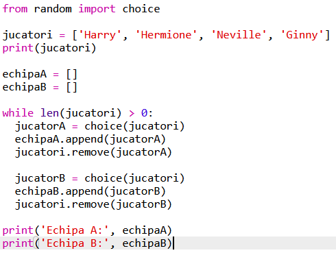

## Alegerea mai multor jucători

Mai departe va trebui să te asiguri că fiecare jucător a fost ales pentru o echipă.

+ Selectează codul pentru alegerea jucătorilor pentru echipa A si echipa B și apasă tasta tab pentru a indenta codul.
    
    

+ Adaugă o structură **while** pentru a alege jucători până când numărul elementelor din lista `jucatori` este 0.
    
    

+ Rulează codul pentru a îl testa. Ar trebui să vezi cum jucătorii sunt aleși pentru echipele A și B până când nu mai rămâne niciunul.
    
    

+ Adaugă cod pentru a afișa lista ta `echipaA` **după** structura ta `while` (asigurându-te că nu este indentată).
    
    Acest lucru înseamnă că `echipaA` va fi afișată o singură dată, după ce toți jucătorii vor fi aleși.
    
    

+ Poți face la fel pentru `echipaB` și poți, de asemenea, să ștergi celelalte comenzi print, care au fost acolo doar pentru a îți testa codul.
    
    Așa ar trebui să arate codul tău:
    
    

+ Testează-ți codul din nou și ar trebui să vezi doar lista ta de jucători, precum și echipele tale finale.
    
    