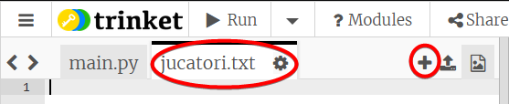
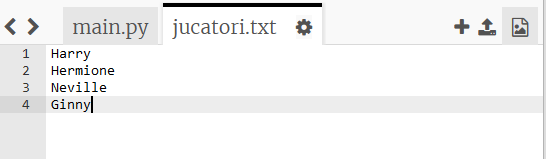
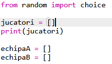
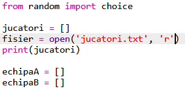
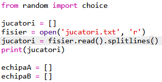

## Fișiere

Poți folosi un fișier pentru a salva lista ta de jucători.

+ Apasă pe pictograma + și crează un fișier nou numit `jucatori.txt`.
    
    

+ Adaugă jucătorii tăi la noul tău fișier. Asigură-te că nu există nicio linie goală după ultimul tău jucător.
    
    

+ Golește lista ta de `jucatori`.
    
    

+ Deschide fișierul tău `jucatori.txt` (`„r”` înseamnă read-only, adică numai citirile sunt permise).
    
    

+ Citește lista din fișier și adaug-o la lista ta de `jucatori`. (Codul `splitlines` înseamnă că fiecare linie din fișier reprezintă un element nou în lista `jucatori`).
    
    

+ Dacă testezi codul, ar trebui să funcționeze la fel ca înainte. Cu toate acestea, acum este mult mai ușor să adaugi jucători la fișierul tău `jucatori.txt`.