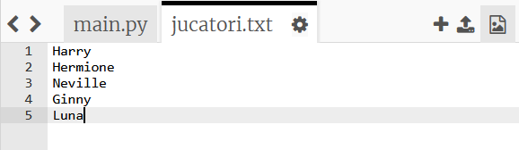
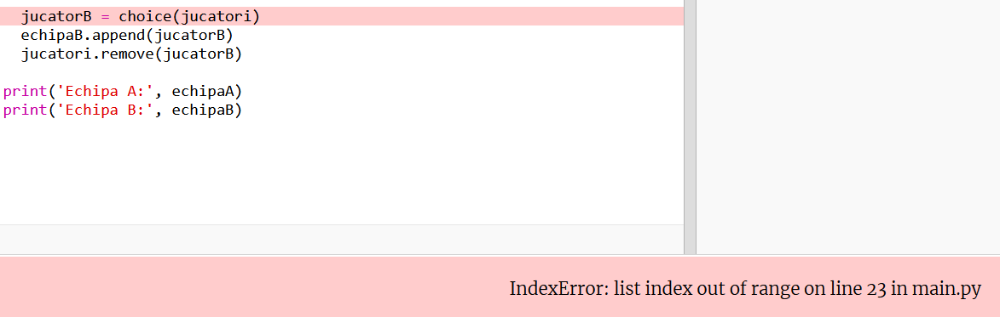
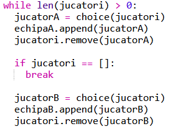
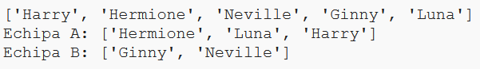

## Jucători impari

Să îmbunătățim programul pentru a funcționa cu un număr impar de jucători.

+ Adaugă un alt nume listei tale `jucatori.txt`, pentru a avea un număr impar de jucători.
    
    

+ Dacă testezi codul, vei vedea că primești un mesaj de eroare.
    
    

+ Această eroare se datorează faptului că programul tău alege jucători la întamplare pentru echipele A și B. Cu toate acestea, dacă numărul de jucători este impar, atunci după ce se alege un jucător pentru echipa A, nu mai rămâne niciun jucător de ales pentru echipa B.
    
    Pentru a rezolva această problemă, îi poți spune programului tău să iasă din din structura ta `while` dacă lista ta de `jucatori` este goală cu ajutorul lui `break`.
    
    

+ Dacă testezi codul din nou, ar trebui să vezi că acum funcționează cu un număr impar de jucători.
    
    