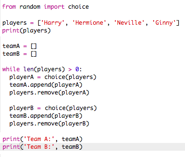

## Välja massor av spelare

Därefter måste du se till att varje spelare har valts för ett lag.

+ Markera din kod för att välja spelare för lag A och lag B och tryck på flikknappen för att dra in koden.
    
    

+ Lägg till en **** slinga för att fortsätta välja spelare tills längden på de `spelare` listan är 0.
    
    

+ Kör din kod för att testa den. Du bör se spelare väljas för lag A och lag B tills det inte finns fler spelare kvar.
    
    

+ Lägg till kod för att skriva ut ditt `teamA` lista **efter** din `medan` loop (se till att den inte är inryckt).
    
    Det betyder att `teamA` bara kommer att skrivas ut en gång, efter att alla spelare har valts.
    
    

+ Du kan göra detsamma för `teamB`, och du kan även ta bort de andra skrivkommandon, eftersom de bara var där för att testa din kod.
    
    Så här ser din kod ut:
    
    

+ Testa din kod igen och du bör bara se din lista över spelare samt dina slutliga lag.
    
    