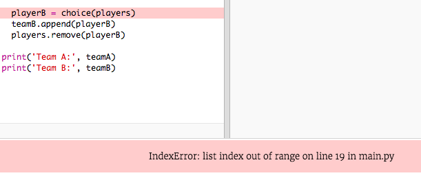
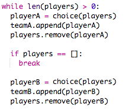
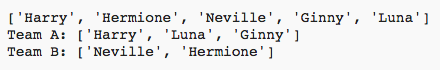

## Odd spelare

Låt oss förbättra ditt program för att arbeta med ett udda antal spelare.

+ Lägg till ett annat namn på din `players.txt` lista, så att du har ett udda antal spelare.
    
    

+ Om du testar din kod ser du att du får ett felmeddelande.
    
    

+ Felet beror på att ditt program fortsätter att välja slumpmässiga spelare för lag A och sedan lag B. Men om det finns ett udda antal spelare, då efter att ha valt en spelare för lag A finns det inga spelare kvar att välja mellan för lag B.
    
    För att fixa den här felet kan du berätta för programmet att `bryta` av `medan` slinga om din `spelare` lista är tom.
    
    

+ Om du testar din kod igen bör du se att den nu fungerar med ett udda antal spelare.
    
    