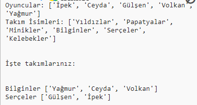

## Giriş:

Bu projede, bir oyuncu listesinden rastgele 2 takım oluşturmayı öğreneceksiniz.

  <iframe src="https://trinket.io/embed/python/a699c44ce6?outputOnly=true&start=result" width="600" height="500" frameborder="0" marginwidth="0" marginheight="0" allowfullscreen>
  </iframe>
  

### Kulüp liderleri için ek bilgi

Bu projeyi yazdırmanız gerekiyorsa, lütfen [Yazıcı dostu sürümü](https://projects.raspberrypi.org/en/projects/team-chooser/print) kullanın.

## \--- collapse \---

## title: Kulüp lideri notları

## Giriş:

Bu projede çocuklar, bir oyuncu listesini rastgele 2 takıma ayıracak bir programın nasıl yapıldığını öğrenecekler. Bu proje listeleri ve dosyaları kullanmayı öğretir.

## Çevrimiçi Kaynaklar

**Bu proje Python 3'ü kullanıyor.** Çevrimiçi Python programlama için [trinket](https://trinket.io/) kullanmanızı tavsiye ederiz. Bu proje aşağıdaki trinketleri içeriyor:

* [Yeni (boş) Python Trinket'ı - jumpto.cc/python-new](http://jumpto.cc/python-new)

Ayrıca tamamlanmış projeyi içeren bir trinket da bulunmaktadır:

* ['Takım Seçici' Tamamlanmış - trinket.io/python/a699c44ce6](https://trinket.io/python/a699c44ce6)

## Çevrimdışı Kaynaklar

Bu proje, istenirse [çevrimdışı](https://www.codeclubprojects.org/en-GB/resources/python-working-offline/) olarak tamamlanabilir. Proje kaynaklarına, bu proje için 'Proje Malzemeleri' bağlantısını tıklayarak erişebilirsiniz. Bu link, çocukların bu projeyi çevrimdışı tamamlamaları için ihtiyaç duyacağı kaynakları içeren bir 'Proje Kaynakları' bölümü içermektedir. Her çocuğun bu kaynakların bir kopyasına erişimi olduğundan emin olun. Bu bölüm aşağıdaki dosyaları içerir:

* team/team.py

Bu projenin tamamlanmış bir versiyonunu aşağıdakileri içeren 'Gönüllü Kaynaklar' bölümünde de bulabilirsiniz:

* team-finished/team.py

(Yukarıdaki kaynakların tümü proje ve gönüllü olarak indirilebilen `.zip` dosyalarıdır)

## Kazanımlar

* Listeler;
* Liste verilerinin bir dosyadan yüklenmesi.

This project covers elements from the following strands of the [Raspberry Pi Digital Making Curriculum](https://rpf.io/curriculum):

* [Basit programlar oluşturmak için temel programlama yapılarını kullanın.](https://www.raspberrypi.org/curriculum/programming/creator)

## Meydan Okumalar

* "Daha fazla oyuncu ekleme" - `oyuncular` listesine eleman ekleme;
* "B takımı için seçim yapma" - İçine rastgele oyuncular eklemek için yeni bir `takimB` listesi oluşturma;
* "Rastgele takım isimleri" - Rastgele isimleri takımlara atamak için yeni bir `takimisimleri` listesi oluşturma ve kullanma;
* "Takım isimlerini kaydetme" - takım isimlerini bir dosyaya kaydetme ve bunları `takimisimleri` değişkenine yükleme;
* "Daha fazla takım" - oyuncuları 2 yerine 3 takıma ayırma.

\--- /collapse \---

## \--- collapse \---

## title: Proje materyalleri

## Proje kaynakları

* You can [find the resources for this project here](https://rpf.io/p/en/team-chooser-go){:target="_blank"}.
* [Çevrimiçi boş Python Trinket'ı](http://jumpto.cc/python-new)
* [Çevrimdışı boş Python dosyası](resources/new-new.py)

## Kulüp lideri için kaynaklar

* You can [find the solutions for this project here](https://rpf.io/p/en/team-chooser-get){:target="_blank"}.
* [Çevrimiçi tamamlanmış Trinket projesi](https://trinket.io/python/a699c44ce6)
* [team-chooser-finished/team-chooser.py](resources/team-chooser-finished-team-chooser.py)

\--- /collapse \---