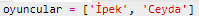
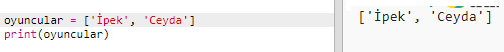
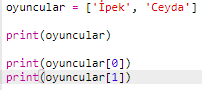

## Oyuncular

Aralarından seçim yapabileceğimiz bir oyuncu listesi oluşturarak başlayalım.

+ Trinket'ta boş Python şablonunu açın: <a href="http://jumpto.cc/python-new" target="_blank">jumpto.cc/python-new</a>.

+ Oyuncuların **listesini** kaydetmek için bir değişken kullanabilirsiniz. Bu liste köşeli parantez `[ ]` içinde olmalı ve listedeki her elemanın arasında virgül bulunmalı.
    
    Programınıza bir oyuncu listesi ekleyerek başlayın.
    
    

+ `oyuncular` değişkeninizi yazdırmak için bu kodu ekleyin:
    
    

+ Listedeki bir öğeye, değişken adından sonra köşeli parantez içindeki konumunu ekleyerek ulaşabilirsiniz.
    
    Listedeki ilk öğe **0 konumunda**'dır. Bu, 1. pozisyondan başlayan Scratch'ten farklıdır.
    
    