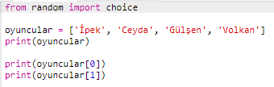
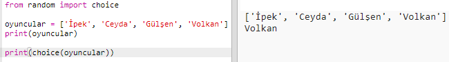
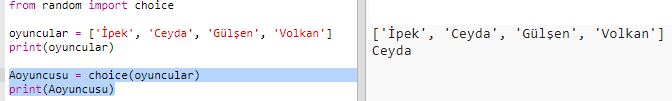
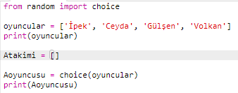
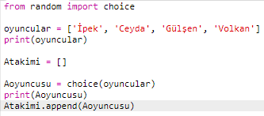
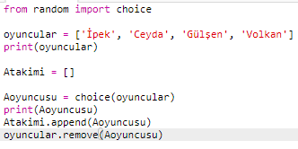
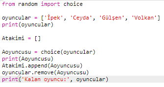

## Rastgele oyuncular

Rasgele oyuncu seçelim!

+ `oyuncular` listenizden rastgele oyuncular seçebilmek için ilk önce `random` modülünün `choice` bölümünü kodlamaya dahil etmeniz gerekiyor.
    
    

+ Rastgele bir oyuncu elde etmek için `choice` komutunu kullanabilirsiniz. (Ayrıca tek tek oyuncuları yazdıran kodu da silebilirsiniz.)
    
    

+ Bir kaç kez `choice` kodunuzu deneyin, her seferinde farklı bir oyuncunun seçilmiş olduğunu göreceksiniz.

+ Rastgele oyuncunuzu kaydetmek için ayrıca yeni bir `Aoyuncusu` değişkeni oluşturabilirsiniz.
    
    

+ A takımındaki tüm oyuncuları saklamak için yeni bir listeye ihtiyacınız olacak. Başlayabilmek için, bu liste boş olmalıdır.
    
    

+ Şimdi rastgele seçilmiş oyuncuları `Atakimi`'na ekleyebilirsiniz. Bunu yapmak için `Atakimi.append` komutunu kullanabilirsiniz (**append** sonuna ekle anlamına gelir).
    
    

+ Artık oyuncunuz seçildiğine göre, onları `oyuncular` listenizden kaldırabilirsiniz.
    
    

+ `print` komutunu ekleyip, içinden seçim yapmak için `oyuncular` listesindeki kalan oyuncuları göstererek kodunuzu test edin.
    
    
    
    Yukarıdaki örnekte, Ceyda `Atakimi` için seçilmişti böylece adı `oyuncular` listesinden çıkarılmış oldu.