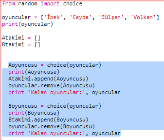
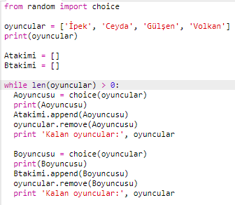
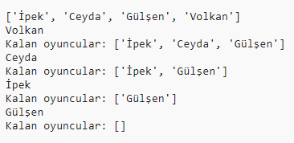
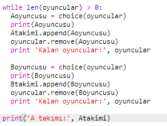
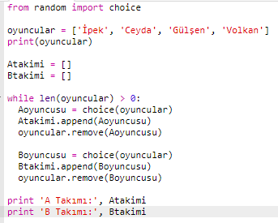
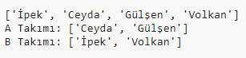

## Çok fazla oyuncu seçme

Sırada her oyuncunun bir takım için seçildiğinden emin olmanız gerekecek.

+ A takımı ve B takımı için oyuncu seçen kodunuzu fareyle seçin ve bu koda girinti yapmak için sekme (TAB) tuşuna basın.
    
    

+ `oyuncular` listesi 0 olana kadar oyuncu seçmesine devam etmek için kodunuza bir **while** döngüsü ekleyin.
    
    

+ Test etmek için kodunuzu çalıştırın. Listede oyuncu kalmayana kadar A takımı ve B takımı için oyuncu seçilmiş olduğunu görmelisiniz.
    
    

+ `Atakimi` listenizi yazdırmak için `while` döngüsünden **sonra** şu kodu ekleyin (girintili olmadığına emin olun).
    
    Bunun anlamı, tüm oyuncular seçildikten sonra `Atakimi` bir kez yazılmış olacak.
    
    

+ Aynı şeyi `Btakimi` için de yapabilirsiniz ve ayrıca diğer yazdır komutlarını da silebilirsiniz çünkü bunlar sadece kodunuzu test etmek için ordalar.
    
    Kodunuzun buradaki gibi görünmeli:
    
    

+ Kodunuzu tekrar deneyin artık oyuncularınızın listesini ve takımların son hallerini görmüş olmalısınız.
    
    