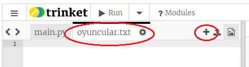
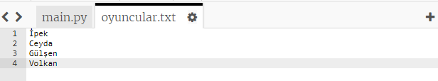
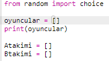
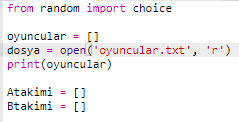
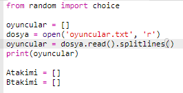

## Dosyalar

Oyuncularınızın listesini kaydetmek için bir dosya kullanabilirsiniz.

+ + simgesine tıklayın ve `oyuncular.txt` adlı yeni bir dosya oluşturun.
    
    

+ Oyuncularınızı yeni dosyanıza ekleyin. Son oyuncunuzdan sonra boş satır olmadığından emin olun.
    
    

+ `oyuncular` listesi değişkeninin boş olmasını sağlayın.
    
    

+ `oyuncular.txt` dosyanızı açın (`'r'` ifadesi dosyanın sadece okunabilir olduğu anlamına gelir).
    
    

+ Dosyadaki listeyi okutun ve `oyuncular` listesi değişkenine ekleyin. (`splitlines` kodu, dosyanın içindeki her satırın, `oyuncular` listesinin yeni birer ögesi olduğu anlamına gelir).
    
    

+ Eğer kodunuzu tekrar denerseniz aynı eskisi gibi çalışıyor olmalı. Ancak, şimdi `oyuncular.txt` dosyasına oyuncu eklemek çok daha kolay.