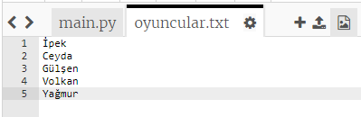
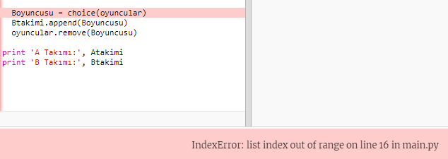
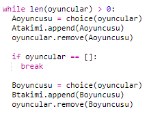
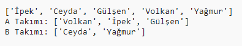

## Tek oyuncular

Programınızı tek sayıda oyuncu ile çalışacak şekilde geliştirelim.

+ `oyuncular.txt` dosyanıza bir oyuncu ismi daha ekleyin ki oyuncu sayısı tek sayı olsun.
    
    

+ Kodunuzu test ederseniz, bir hata mesajı aldığınızı göreceksiniz.
    
    

+ Bunun nedeni, programınızın A takımı ve ardından B takımı için rastgele oyuncuları seçmeye devam etmesidir. Ancak, eğer eşit sayıda olmayan oyuncular varsa, A takımı için bir oyuncu seçildikten sonra, B takımı için seçilecek oyuncu kalmayacak.
    
    Bu hatayı düzeltmek için, programınıza `oyuncular` listesi boşalana kadar devam eden `while` döngüsünü `durdurmasını` söyleyebilirsiniz.
    
    

+ Kodunuzu tekrar test ederseniz, kodunuzun artık tek sayıda oyuncuyla çalıştığını görmeniz gerekir.
    
    