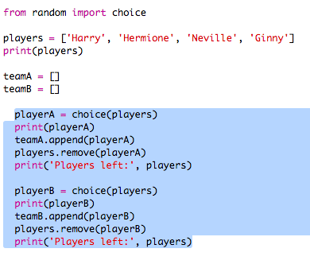
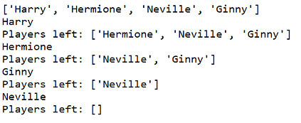

## Вибір багатьох гравців

Далі вам потрібно буде переконатися, що кожен гравець вибраний для команди.

+ Виділіть свій код для вибору гравців для команди A та команди B і натисніть клавішу tab, щоб відступити код.
    
    

+ Додайте **, поки** цикл, щоб продовжувати вибирати гравців, доки тривалість `гравців` не буде 0.
    
    

+ Запустіть код, щоб перевірити його. Ви повинні побачити гравців, вибраних для команди А та команди Б, поки не залишиться більше гравців.
    
    

+ Додайте код, щоб надрукувати `teamA` список **після** вашої `, а` - цикл (переконайтеся, що він не відступується).
    
    Це означає, що `teamA` буде надруковано лише один раз після вибору всіх гравців.
    
    

+ Ви можете зробити те ж саме для `teamB`, і ви також можете видалити інші команди друку, оскільки вони були лише там, щоб перевірити ваш код.
    
    Ось як виглядає ваш код:
    
    

+ Перевірте свій код ще раз, і ви повинні просто побачити свій список гравців, а також ваших остаточних команд.
    
    