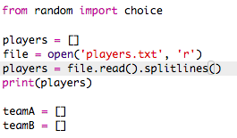

## Файли

Ви можете використовувати файл для зберігання вашого списку гравців.

+ Натисніть піктограму + і створіть новий файл із назвою `players.txt`.
    
    

+ Додайте своїх гравців до нового файлу. Переконайтеся, що після останнього гравця немає порожньої рядка.
    
    

+ Змініть `гравців` список, щоб він був порожнім.
    
    

+ Відкрийте `player.txt` файл ( `'r'` означає лише читання).
    
    

+ Прочитайте список з файлу та додайте до `гравця` списку. (Код `splitlines` означає, що кожен рядок у файлі є новим елементом у списку `гравців`).
    
    

+ Якщо ви перевіряєте свій код, він повинен працювати точно так само, як і раніше. Проте зараз простіше додавати гравців до вашого `players.txt` файлу.