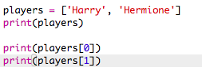

## Người chơi

Hãy bắt đầu bằng cách tạo danh sách người chơi để chọn.

+ Mở mẫu Python Trinket trống: <a href="http://jumpto.cc/python-new" target="_blank">jumpto.cc/python-new</a>.

+ Bạn có thể sử dụng một biến để lưu trữ một danh sách **** người chơi. Danh sách phải nằm trong dấu ngoặc vuông `[]`, có dấu phẩy giữa mỗi mục trong danh sách.
    
    Bắt đầu bằng cách thêm danh sách người chơi vào chương trình của bạn.
    
    

+ Thêm mã này để in `người chơi của bạn` biến:
    
    

+ Bạn có thể truy cập một mục trong danh sách bằng cách thêm vị trí của nó trong dấu ngoặc vuông sau tên biến.
    
    Mục đầu tiên trong danh sách là **vị trí 0**. Điều này khác với Scratch, bắt đầu ở vị trí 1.
    
    