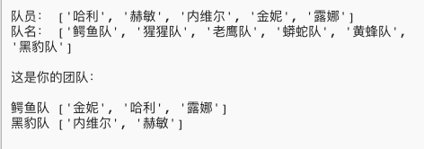

## 介绍

在这个项目中，您将学习如何从一个队员列表中随机地选择队员来创建2个团队。

  <iframe src="https://trinket.io/embed/python/ca3af66f8d?outputOnly=true&start=result" width="600" height="500" frameborder="0" marginwidth="0" marginheight="0" allowfullscreen>
  </iframe>
  

### 俱乐部导师的附加信息

如果您需要打印此项目，请使用[适合打印版本](https://projects.raspberrypi.org/zh-CN/projects/team-chooser/print) 。

--- collapse ---
---
title: 俱乐部导师说明
---

## 介绍：

在这个项目中，孩子们将学习如何制作一个程序，将一组队员随机分成2个团队。 这个项目教授列表和使用文件。

## 在线资源

**本项目使用Python 3。**我们建议使用[trinket](https://trinket.io/)在线编写Python代码。 这个项目包含如下Trinket代码:

* [新建（空白）Python Trinket -- jumpto.cc/python-new](http://jumpto.cc/python-new)

还有一个包括已完成项目的Trinket：

* [完成的”组队器“ -- trinket.io/python/a699c44ce6](https://trinket.io/python/ca3af66f8d)

## 离线资源

如果你愿意，本项目可以[离线完成](https://www.codeclubprojects.org/en-GB/resources/python-working-offline/)。 你可以点击本项目的'项目资料'链接访问项目资源。 这个链接包含一个 “项目资源” 部分，里面有孩子们完成该项目所需的离线资源。 请确保每个孩子都可以访问这些资源。 这部分包含如下文件：

* team/team.py

你也可以在 “志愿者资源'”部分找到该项目的完成版本，里面包含：

* team-finished/team.py

(上述所有资源都可以以`.zip`压缩包的形式下载。)

## 学习目标

* 列表；
* 从文件中加载列表数据。

本项目涵盖[树莓派数字制作课程](https://rpf.io/curriculum)如下几方面内容：

* [利用基本编程结构创建简单程序。](https://www.raspberrypi.org/curriculum/programming/creator)

## 挑战

* “添加更多队员” - 向`players`列表添加更多成员。
* “为Ｂ队选择队员” - 创建一个新的`teamB`列表，并向其添加随机队员；
* “随机团队名称” - 创建和使用新的`teamNames`列表为团队分配随机名称;
* “保存团队名称” - 将团队名称保存在文件中，并将其加载到`teamNames`变量中；
* “更多团队” - 将队员分成3队而不是2队。

--- /collapse ---

--- collapse ---
---
title: 项目资源
---

## 项目资源

* [包含所有项目资源的.zip文件](resources/team-chooser-project-resources.zip)
* [在线空白Python Trinket项目](http://jumpto.cc/python-new)
* [离线空白Python文件](resources/new-new.py)

## 俱乐部导师资源

* [包含所有完成项目资源的.zip文件](resources/team-chooser-volunteer-resources.zip)
* [在线已完成的Trinket项目](https://trinket.io/python/ca3af66f8d)
* [team-chooser-finished/team-chooser.py](resources/team-chooser-finished-team-chooser.py)

--- /collapse ---