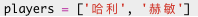
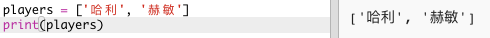
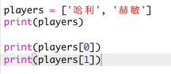

## 队员

让我们首先创建一个可供选择的队员列表。

+ 单击链接<a href="http://jumpto.cc/python-new" target="_blank">jumpto.cc/python-new</a>，打开一个空白的Trinket Python模版。

+ 您可以使用变量来保存队员**列表** 列表应在一对方括号`[ ]`中 ，列表中的成员之间用逗号分隔。
    
    首先在你的程序中添加一个队员列表。
    
    

+ 添加此代码以显示`players`变量：
    
    

+ 您可以通过在变量名称后面的方括号中添加其位置来获取列表中的一个成员。
    
    列表中的第一个成员在**位置０**。 这与Scratch不同，后者是从1开始。
    
    