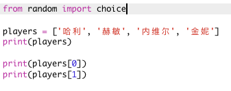
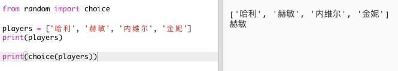
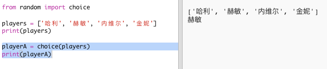
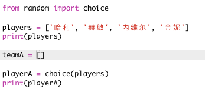
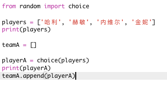
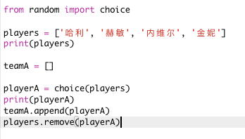
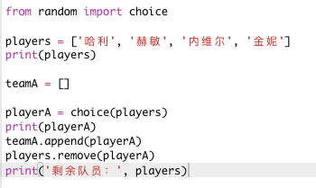

## 随机队员

让我们随机选择一些队员！

+ 为了能够从你的 `队员` 列表中获得一个随机队员，首先你需要导入`random`模块中的`choice` 函数。
    
    

+ 要获得一个随机的队员, 你可以使用 `choice`。 （您也可以删除代码以显示单个队员。）
    
    

+ 测试几次你的 `choice` 代码, 你应该看到每次都会有一个不同的队员被选中。

+ 您还可以创建一个名为 `playerA` 的新变量, 并使用它来保存随机选择的队员。
    
    

+ 你还需要一个新的列表来保存Ａ队中的所有队员。在一开始，这个列表应该是空的。
    
    

+ 现在你可以将随机选择的队员添加到`teamA`。 为此，你可以使用 `teamA.append` 方法（**append** 表示添加到末尾）。
    
    

+ 现在, 你的队员已被选中，你可以将他们移出 `players` 列表。
    
    

+ 通过添加 `print` 命令来测试此代码, 以显示 `players`列表中余下的可供选择的队员。
    
    
    
    在上面的例子中，赫敏被选入 `teamA`，因此她被移出 `players` 列表。