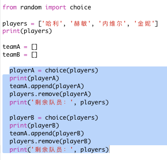
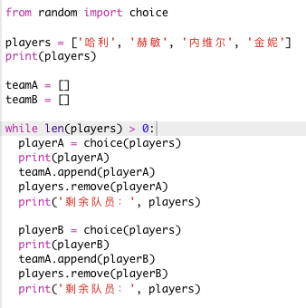
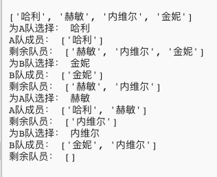
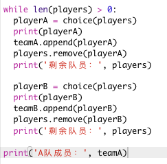
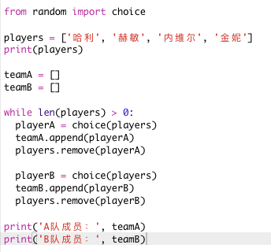
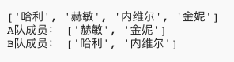

## 选择大量玩家

接下来你将需要确保每个玩家都被选入了一个团队。

+ 选中用于选择 A 队和 B 队玩家的代码并按 tab 键来缩进代码。

	

+ 添加一个 __while__ 循环来不断选择玩家，直至 `players`（玩家）列表的长度为 0。

	

+ 运行你的代码来进行测试。你会看到玩家不断被选入 A 队和 B 队，直至没有玩家剩余。

	

+ 在 `while` 循环__后面__（确保其未被缩进）添加代码来打印出 `teamA`（A 队）列表。

	这意味着在所有玩家都被选中之后，`teamA`（A 队）仅会被打印一次。

	

+ 你可以对 `teamB`（B 队）进行同样操作，你还可以删除其他打印命令，因为它们只是为了测试你的代码。

	你的代码应如下所示：

	

+ 再次测试你的代码，你只会看到你的玩家列表以及你的最终团队。

	

