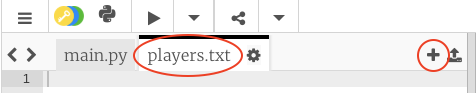
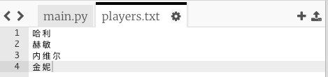
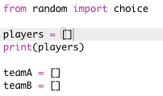
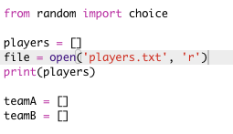
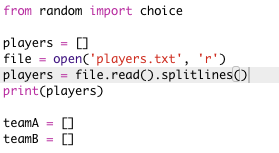

## 文件

您可以使用文件来保存你的队员名单。

+ 单击 + 图标并新建一个名为 `players.txt` 的新文件。
    
    

+ 将你的队员名单加入到新文件中。 确保在最后一名队员之后没有空行。
    
    

+ 修改你的 `players` 列表, 使其为空。
    
    

+ 打开你的 `players.txt` 文件（`‘r‘` 表示只读打开）。
    
    

+ 从文件中读取列表并添加到`players`列表。 (`splitlines` 代码表示文件中的每一行都是 `players` 列表中的一个新成员)。
    
    

+ 如果测试你的代码,，它应该和之前的有一模一样的结果。 然而，现在将队员添加到 `players.txt` 文件的做法要容易得多。