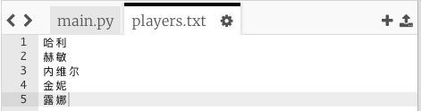
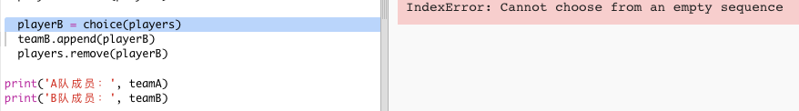
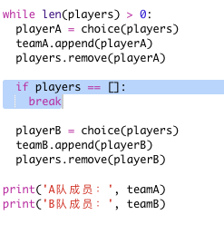
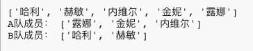

## 奇数玩家

让我们完善你的程序，来处理奇数玩家的情况。

+ 向你的 `players.txt` 列表添加另一个名称，使得你的玩家数量为奇数。

	

+ 如果你测试你的代码，你会发现遇到一条错误消息。

	

+ 错误是因为你的程序一直先为 A 队然后为 B 队选择随机玩家。但如果玩家数目为奇数，那么最后在为 A 队选择一名玩家之后就没有剩余玩家供 B 队选择。

	为修复这个错误，你可以告诉你的程序，如果 `players`（玩家）列表中没有任何内容，则 `break`（中断）你的 `while` 循环。

	

+ 如果再次测试你的代码，你会发现代码现在可以处理奇数玩家了。

	

