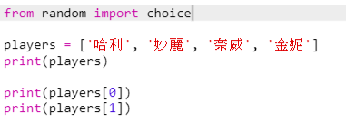
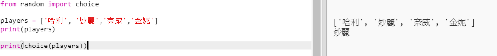
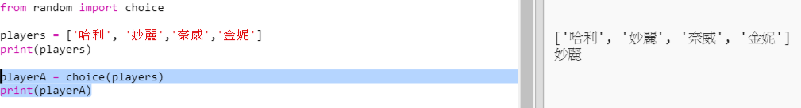
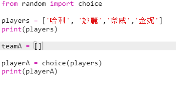
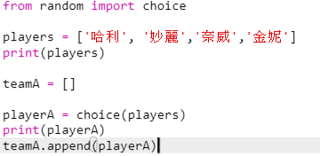
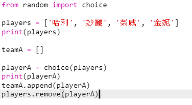
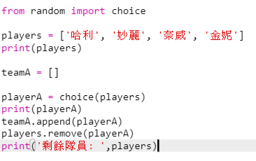

## 隨機隊員

讓我們隨機選擇一些隊員！

+ 為了能夠從你的`players`列表中獲得一個隨機隊員，首先你需要匯入`random`模組中的`choice` 函式。
    
    

+ 要獲得一個隨機的隊員, 你可以使用 `choice`。 （您也可以刪除程式碼以顯示單個隊員。）
    
    

+ 測試幾次你的 `choice` 程式碼, 你會看到每次都有一個不同的隊員被選中。

+ 您還可以建立一個名為`playerA`的新變數, 並使用它來儲存你隨機選擇的隊員。
    
    

+ 你還需要一個新的列表來儲存Ａ隊中的所有隊員。在一開始，這個列表應該是空的。
    
    

+ 現在你可以將隨機選擇的隊員新增到`teamA`。 為此，你可以使用`teamA.append` （**append** 表示在後方新增）。
    
    

+ 現在你可以將被選中的隊員從 `players` 列表中刪除。
    
    

+ 通過新增`print` 指令來測試此程式碼, 以顯示`players`列表中剩下可以選取的隊員。
    
    
    
    在上面的例子中，妙麗被選入`teamA`，因此她從`players`列表中刪除。