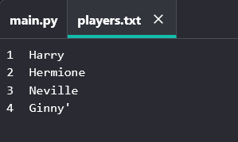

## 檔案

您可以使用檔案來儲存你的隊員名單。

\--- task \---

Click **Add file** and create a new file called `players.txt`.

\--- /task \---

\--- task \---

+ 將你的隊員名單加入到新檔案中。 確保在最後一名隊員之後沒有空行。

\--- /task \---

\--- task \---

清空你的 `players `列表。

## \--- code \---

language: python filename: main.py line_numbers: true line_number_start: 1

## line_highlights: 3

from random import choice

players = []

team_A = [] team_B = []

\--- /code \---

\--- /task \---

\--- task \---

開啟你的` players.txt `檔案（`‘r‘ `表示唯讀）。

## \--- code \---

language: python filename: main.py line_numbers: true line_number_start: 1

## line_highlights: 4

from random import choice

players = [] file = open('players.txt', 'r')

team_A = [] team_B = []

\--- /code \---

\--- /task \---

\--- task \---

從檔案中讀取列表並新增到`players`列表。 (`splitlines `程式碼表示檔案中的每一行都是` players ` 列表中的一個新成員)。

## \--- code \---

language: python filename: main.py line_numbers: true line_number_start: 1

## line_highlights: 5

from random import choice

players = [] file = open('players.txt', 'r') players = file.read().splitlines()

team_A = [] team_B = []

\--- /code \---

\--- /task \---

\--- task \---

如果進行測試，您的程式碼將與此前的執行一致。 然而，現在將隊員新增到 `players.txt `檔案的做法要容易得多。

\--- /task \---